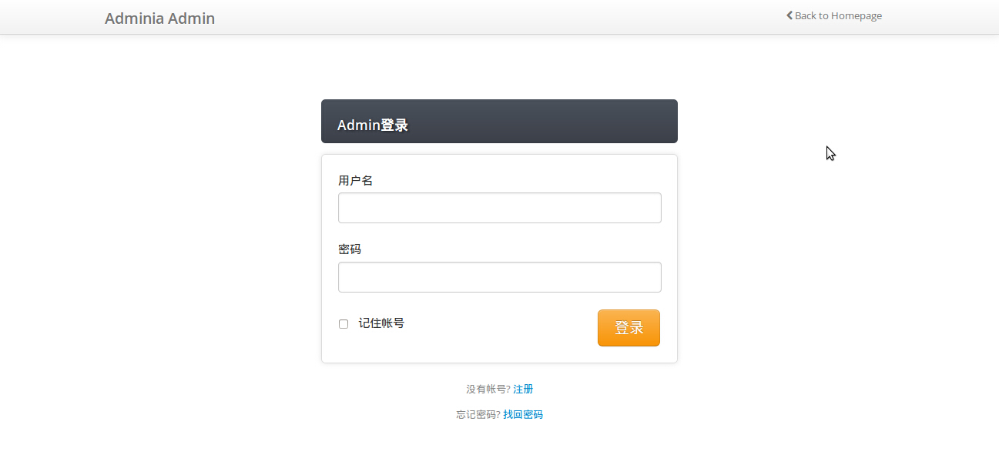
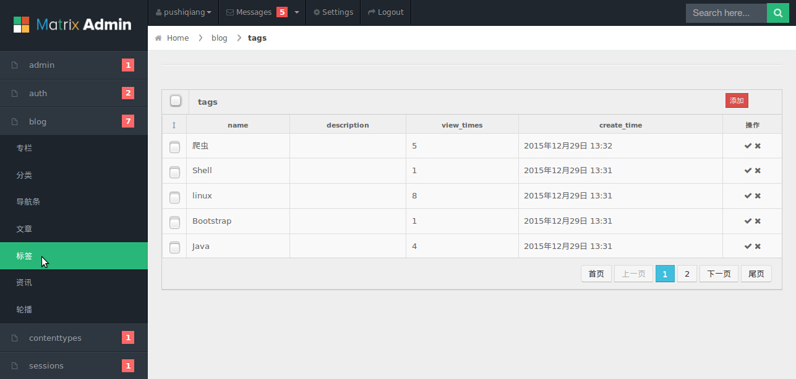
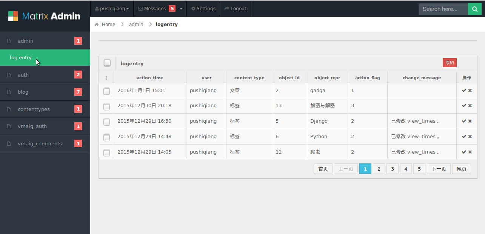
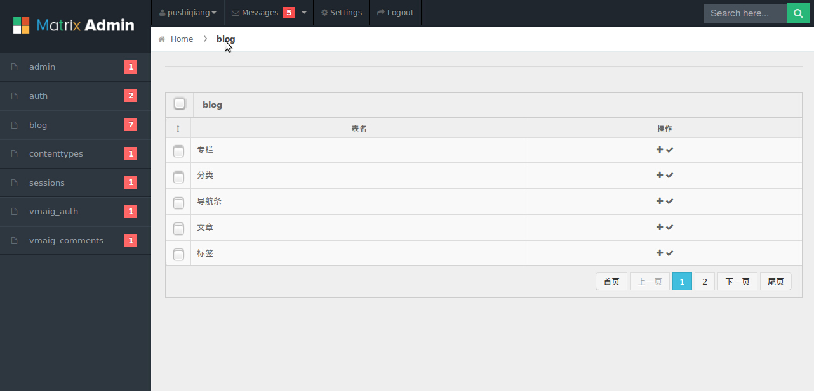
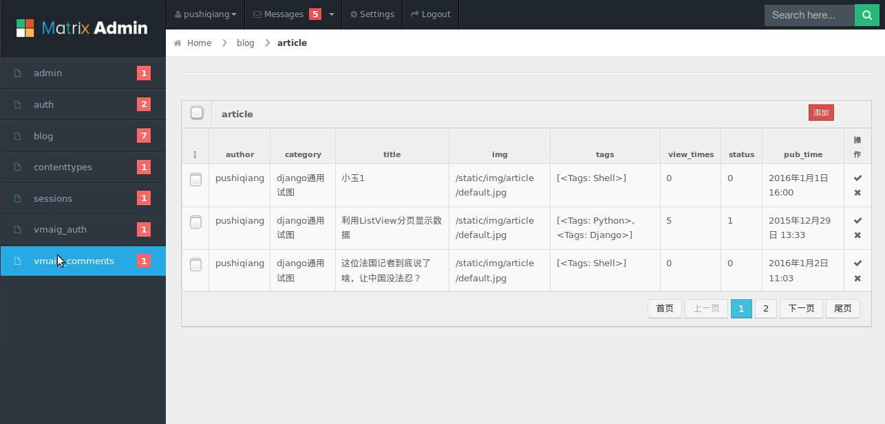

# django_admin_framework
基于通用视图的admin框架 
新手入门之作，大神勿喷。 
为了方便采用了display views和editing views视图实现，使用到了自定义过滤器，自定义标签，inclusion标签等 
添加数据页面由于了使用通用视图的form模式，很不美观，下一步准备去掉通用视图，加入搜索过滤功能。 
权限和认证系统还在学习中 
This is a django admin framework based on general views powerd by pushiqiang of rookie 

python 2.7 
django 1.7

qq:983003089 
预览
=====

运行使用
=====
1.设置settings
---

INSTALLED_APPS = ( 
　　　　'myadmin', 
)
2.设置url
---
　　　　url(r'^myadmin/',include('myadmin.urls')),
3.设置admin_settings（可以不用设置）
---
　　　　在myadmin/admin_settings.py文件中设置要显示的field，默认显示所有的field,如xxx_admin = {'list_display':['name','description','status'],}，暂时只设置了list_display。

